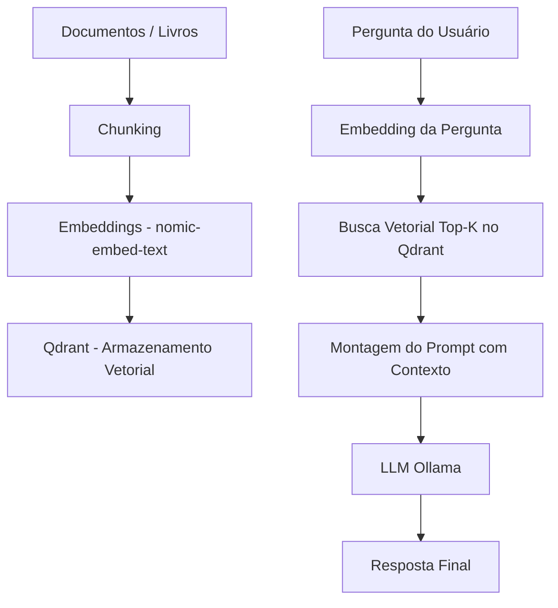

# 🧠 Guia Técnico e Operacional

Documentação objetiva para implementação performática de Retrieval-Augmented Generation (RAG)
na stack Docker (Ollama + Qdrant + Flask + N8N).

---

# 📌 O que é RAG

RAG (Retrieval-Augmented Generation) é uma arquitetura onde:

1. Seus documentos são convertidos em embeddings
2. Esses embeddings são armazenados em um banco vetorial
3. A cada pergunta:

   * A pergunta vira embedding
   * O banco retorna os trechos mais similares
   * O modelo responde usando esse contexto

O modelo NÃO "aprende" permanentemente.
Ele recebe contexto dinamicamente.

---

# 🏗️ Diagrama Visual do Fluxo RAG



---

# 📐 Como Escolher a Dimensão dos Embeddings

## ❗ Regra Importante

A dimensão NÃO é escolhida manualmente.
Ela é determinada pelo modelo de embedding.

Exemplo:

```
nomic-embed-text → 768 dimensões
bge-large → 1024 dimensões
```

## Como descobrir a dimensão real

```bash
curl -s http://localhost:11434/api/embeddings \
  -H "Content-Type: application/json" \
  -d '{"model":"nomic-embed-text","prompt":"teste"}' \
  | python3 -c "import sys,json; print(len(json.load(sys.stdin)['embedding']))"
```

O número retornado é o valor correto para a coleção.

---

# 🗂️ Criando Coleção no Qdrant

Exemplo para modelo com 768 dimensões:

```bash
curl -X PUT "http://localhost:6333/collections/runomante_kb" \
  -H "Content-Type: application/json" \
  -d '{
    "vectors": { "size": 768, "distance": "Cosine" }
  }'
```

## Distância recomendada

* Cosine → ideal para embeddings de linguagem natural
* Dot → alternativa rápida
* Euclid → menos comum para texto

---

# ✂️ Chunking Ideal

| Parâmetro  | Valor Recomendado   |
| ---------- | ------------------- |
| Chunk Size | 800–1200 caracteres |
| Overlap    | 120–200 caracteres  |
| Top-K      | 4–8                 |

Chunks muito grandes → embeddings pesados e menos precisos
Chunks muito pequenos → perda de contexto

---

# 🚀 Batch Upsert (Forma Performática)

Salvar um embedding por vez é lento.

Forma correta: enviar lotes de 100–500 pontos.

## Estrutura de um ponto

```json
{
  "id": "hash_unico",
  "vector": [0.123, -0.991, ...],
  "payload": {
    "text": "trecho do livro",
    "doc_id": "compendio_v1",
    "chapter": "3"
  }
}
```

## Exemplo Python Batch Upsert

```python
from qdrant_client import QdrantClient
from qdrant_client.http.models import PointStruct

client = QdrantClient("http://localhost:6333")

points = []

for i in range(200):
    points.append(
        PointStruct(
            id=str(i),
            vector=[0.1] * 768,
            payload={"doc_id": "teste"}
        )
    )

client.upsert(collection_name="runomante_kb", points=points)
```

---

# ⚡ Fluxo de Consulta Performático

1️⃣ Gerar embedding da pergunta

```bash
curl -s http://localhost:11434/api/embeddings \
  -H "Content-Type: application/json" \
  -d '{"model":"nomic-embed-text","prompt":"O que é o Futhark?"}'
```

2️⃣ Buscar no Qdrant

```bash
curl -X POST "http://localhost:6333/collections/runomante_kb/points/search" \
  -H "Content-Type: application/json" \
  -d '{
    "vector": [...embedding...],
    "limit": 5,
    "with_payload": true
  }'
```

3️⃣ Montar prompt

```
Use apenas o contexto abaixo:

[trechos retornados]

Pergunta: ...
```

4️⃣ Enviar para Ollama

---

# 🧠 Melhores Práticas de Performance

✔ Uma coleção por modelo de embedding
✔ Batch upsert (100–500 pontos)
✔ IDs estáveis (hash) para evitar duplicação
✔ Metadata estruturada (doc_id, chapter, tags)
✔ Filtros na busca para reduzir espaço vetorial
✔ Cache de embeddings da pergunta (opcional)
✔ Reindex incremental apenas do que mudou
✔ Manter top-K baixo

---

# 📊 Estratégia de Escala

| Volume de Dados | Estratégia          |
| --------------- | ------------------- |
| < 50k chunks    | Configuração padrão |
| 50k–500k        | Ativar HNSW tuning  |
| > 1M            | Sharding / cluster  |

---

# 🔎 Quando Criar Nova Coleção

* Mudança de modelo de embedding
* Mudança significativa de estratégia de chunking
* Separação por domínio (ex: livros vs notas técnicas)

---

# 🎯 Resumo Estratégico

RAG eficiente depende de:

1. Modelo de embedding correto
2. Dimensão correta da coleção
3. Chunking equilibrado
4. Batch upsert
5. Busca com filtros
6. Prompt bem estruturado

O modelo LLM só responde melhor se o contexto for bem recuperado.
A performance está na indexação, não no modelo.

---

🚀 Stack preparada para base de conhecimento performática e escalável.
